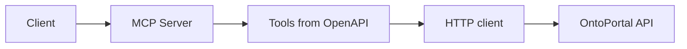
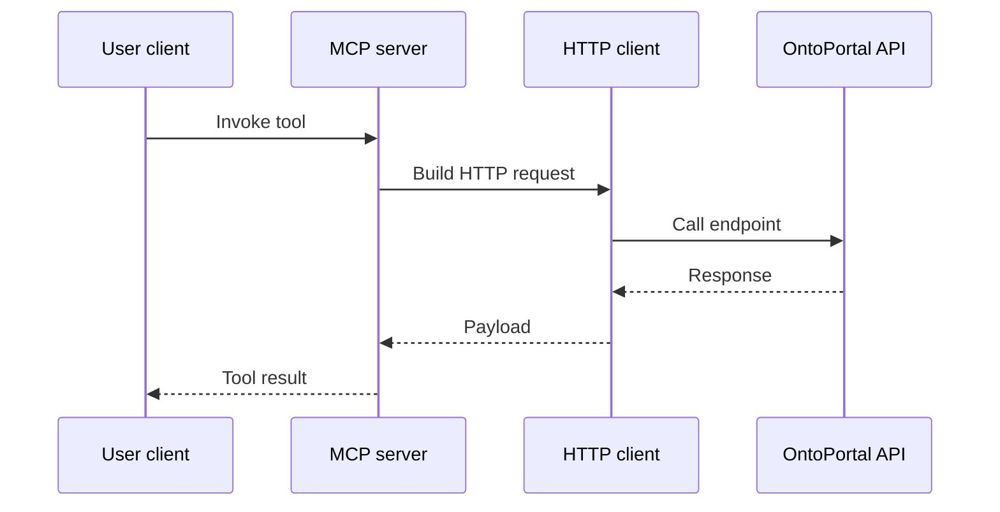

# OntoPortal MCP Server Architecture [overview]

Table of Contents
- [OntoPortal MCP Server Architecture \[overview\]](#ontoportal-mcp-server-architecture-overview)
  - [1) Executive Summary and Scope \[overview\]](#1-executive-summary-and-scope-overview)
  - [2) System Overview and Purpose \[system-overview\]](#2-system-overview-and-purpose-system-overview)
  - [3) Architecture \[architecture\]](#3-architecture-architecture)
  - [4) Components and Responsibilities \[components\]](#4-components-and-responsibilities-components)
  - [5) API Specification Overview \[api-spec\]](#5-api-specification-overview-api-spec)
  - [6) Security Model \[security\]](#6-security-model-security)
  - [7) Dependencies and Environment \[dependencies\]](#7-dependencies-and-environment-dependencies)
  - [8) Operational Workflows \[workflows\]](#8-operational-workflows-workflows)
  - [9) Configuration \[configuration\]](#9-configuration-configuration)
  - [10) Deployment and Runtime \[deployment-runtime\]](#10-deployment-and-runtime-deployment-runtime)
  - [11) Logging and Observability \[logging\]](#11-logging-and-observability-logging)
  - [12) Error Handling and Failure Modes \[error-handling\]](#12-error-handling-and-failure-modes-error-handling)
  - [13) Data Models and Schemas \[data-models\]](#13-data-models-and-schemas-data-models)
  - [14) Tool Generation Mapping \[tool-mapping\]](#14-tool-generation-mapping-tool-mapping)
  - [15) Differences between Specs \[spec-differences\]](#15-differences-between-specs-spec-differences)
  - [16) Limitations, Risks, and Assumptions \[limitations\]](#16-limitations-risks-and-assumptions-limitations)
  - [17) Future Enhancements \[future\]](#17-future-enhancements-future)
  - [18) Glossary \[glossary\]](#18-glossary-glossary)
  - [19) References \[references\]](#19-references-references)
  - [20) Appendices \[appendices\]](#20-appendices-appendices)

## 1) Executive Summary and Scope [overview]

This document describes the architecture, components, security model, operations, and deployment considerations for the OntoPortal MCP server implementation. The system maps the OntoPortal OpenAPI specifications ([openapi.yaml](openapi.yaml), [openapi-small.yaml](openapi-small.yaml)) into Machine Connection Protocol (MCP) tools using [FastMCP.from_openapi()](mcp_server.py:32), and exposes those tools to MCP clients. Incoming MCP requests are currently accepted without additional authentication; the design notes retain guidance for adding JWT-based verification in the future. Authorized server-side calls to the OntoPortal HTTP API are made with [httpx.AsyncClient()](mcp_server.py:17) using an embedded API key. The MCP runtime is started via [mcp.run()](mcp_server.py:41). Validation of OpenAPI specs is performed by [read_from_filename()](validate.py:10) and [validate()](validate.py:11).

Scope includes:
- Architectural composition of the MCP server and its interactions with the OntoPortal API.
- Component responsibilities, operational workflows, and security considerations, including notes on the optional JWT layer.
- Configuration, dependencies, logging, error handling, and appendices summarizing endpoints, schemas, and tool mappings.

## 2) System Overview and Purpose [system-overview]

Purpose:
- Provide an MCP-compliant server that exposes OntoPortal functionality as tools derived from OpenAPI specs.
- Bridge client calls to OntoPortal using a server-managed API key, eliminating the need for callers to handle OntoPortal credentials directly.
- Ship a lightweight MCP client ([mcp_client.py](../mcp_client.py)) so downstream applications and tests can exercise the generated tools.

- [README.md](README.md): Project overview and usage guidance.
- [openapi.yaml](openapi.yaml), [openapi-small.yaml](openapi-small.yaml): OntoPortal OpenAPI specifications.
- [mcp_server.py](mcp_server.py): MCP server implementation and OpenAPI-to-tools mapping.
- [mcp_client.py](../mcp_client.py): Async client wrapper for Streamable HTTP connections, used by tooling and tests.
- [check_http_access.py](../check_http_access.py): Connectivity probe that exercises `list_tools` and a sample tool call.
- [validate.py](validate.py): Spec validation helpers.
- [generate_token.py](generate_token.py): JWT token creation utility.
- [.env.example](../.env.example): Sample environment configuration (copy to `.env` and edit for deployment).
- [mcp_server.log](mcp_server.log): Runtime log output.
- [requirements.txt](requirements.txt): Dependency list.
- [tests/test_mcp_client.py](../tests/test_mcp_client.py): Integration tests executed against a live MCP endpoint (configurable via `ONTO_PORTAL_MCP_URL`).

## 3) Architecture [architecture]

The MCP server translates OpenAPI operations into callable tools and serves them over Streamable HTTP. When a client invokes a tool:
1. The server issues an HTTP call to OntoPortal using [httpx.AsyncClient()](mcp_server.py:17), mapping tool parameters to API request parameters.
2. Responses are returned to the client via MCP.

Connections may optionally supply query parameters on the MCP URL (e.g. `?api_key=...&base_url=...`). A lightweight middleware extracts these values on the `initialize` request and stores them with the underlying session so every subsequent tool call uses the caller’s specific OntoPortal API key and base URL.

OpenAPI-to-tool mapping is established through [FastMCP.from_openapi()](mcp_server.py:32), loading spec content (often via [yaml.safe_load()](mcp_server.py:12) semantics) and registering operations. The server runtime is initiated with [mcp.run()](mcp_server.py:41).

Component diagram:



Request-response sequence:

```mermaid
sequenceDiagram
participant C as Client
participant S as MCP Server
participant H as HTTP client
participant O as OntoPortal API
C->>S: Invoke tool
S->>H: Build request from tool params
H->>O: HTTP request
O-->>H: HTTP response
H-->>S: Result payload
S-->>C: Tool response
end
```

Key constructs:
- [yaml.safe_load()](mcp_server.py:12): Safe YAML parsing for spec or config inputs.
- [httpx.AsyncClient()](mcp_server.py:17): Async HTTP transport to OntoPortal.
- [FastMCP.from_openapi()](mcp_server.py:32): Automatic tool generation from OpenAPI.
- [mcp.run()](mcp_server.py:41): Launch MCP server runtime.

## 4) Components and Responsibilities [components]

Specifications:
- Primary spec: [openapi.yaml](openapi.yaml)
- Reduced spec: [openapi-small.yaml](openapi-small.yaml)
  - Both define servers, operations, schemas, and security details used to generate tools via [FastMCP.from_openapi()](mcp_server.py:32).

Server behaviors in [mcp_server.py](mcp_server.py):
- Spec loading and parsing leveraging [yaml.safe_load()](mcp_server.py:12).
- HTTP execution via [httpx.AsyncClient()](mcp_server.py:17).
- Tool generation and registration using [FastMCP.from_openapi()](mcp_server.py:32).
- Runtime execution with [mcp.run()](mcp_server.py:41).

Validation in [validate.py](validate.py):
- [read_from_filename()](validate.py:10): Load and parse OpenAPI file contents.
- [validate()](validate.py:11): Validate spec structure and constraints, suitable for preflight checks before server startup.

Token utilities in [generate_token.py](generate_token.py):
- [create_jwt()](generate_token.py:12): Example helper for generating JWTs (useful if inbound authentication is re-enabled).
- [jwt.encode()](generate_token.py:23): Encode payload using configured secret and algorithm.

## 5) API Specification Overview [api-spec]

Servers:
- Defined in [openapi.yaml](openapi.yaml) and [openapi-small.yaml](openapi-small.yaml). The server URLs describe the OntoPortal base endpoints that MCP tools will target via [httpx.AsyncClient()](mcp_server.py:17).

High-level path groups:
- Ontologies: operations to list, retrieve, and manage ontology records.
- Classes: operations to browse ontology classes, retrieve details, and navigate hierarchies.
- Properties: operations for ontology properties metadata.
- Search: operations enabling keyword or faceted search across ontologies and classes.
- Mappings and Annotations: operations to relate concepts and attach annotations.
- Admin or Utilities: health, status, and supporting endpoints.

Schemas:
- Core resource models for ontologies, classes, properties, mappings, search results, and pagination envelopes.
- Common error schemas capturing HTTP error payloads.

Security:
- OntoPortal side uses ApiKey style access in the HTTP layer (header or query-based) which the MCP server injects automatically.
- Inbound MCP authentication is currently open; future deployments can layer JWT or other authentication in front of the Streamable HTTP endpoint.

## 6) Security Model [security]

Current layers:
1. OntoPortal HTTP-side ApiKey
   - The MCP server stores an ApiKey (see [mcp_server.py](mcp_server.py)) and attaches it to every OntoPortal request.
2. Optional MCP-side authentication
   - The Streamable HTTP endpoint does not enforce authentication by default. Deployments can introduce JWT, mTLS, or gateway-level checks. The `generate_token.py` utility demonstrates how a JWT flow could be implemented if desired.
   - Query parameters (`api_key`, `base_url`) on the MCP URL allow per-connection overrides without exposing secrets in model prompts.

Future hardening considerations:
- Externalize secrets (API keys or tokens) into environment variables or secret managers.
- Map prospective JWT claims to tool access scopes before enabling an inbound auth layer.
- Ensure logging scrubs sensitive headers regardless of the chosen authentication model.

Hard-coded secrets:
- Review [mcp_server.py](mcp_server.py) and [generate_token.py](generate_token.py) for any embedded secrets or default keys. Replace with environment variables and secret management in production.

## 7) Dependencies and Environment [dependencies]

Dependencies from [requirements.txt](requirements.txt) are used for:
- MCP server framework and OpenAPI-to-tool mapping.
- HTTP client for OntoPortal calls via [httpx.AsyncClient()](mcp_server.py:17).
- JWT utilities (via [create_jwt()](generate_token.py:12) and [jwt.encode()](generate_token.py:23)) that can support future authentication layers.

Missing deps to note for full functionality:
- openapi_spec_validator: required for spec validation in [validate.py](validate.py) alongside [validate()](validate.py:11).
- PyYAML: required for YAML parsing complementary to [yaml.safe_load()](mcp_server.py:12).

Ensure these are included and pinned appropriately to avoid runtime failures.

## 8) Operational Workflows [workflows]

End-to-end workflow:
1. Validate spec:
   - Run [validate.py](validate.py) using [read_from_filename()](validate.py:10) and [validate()](validate.py:11) for [openapi.yaml](openapi.yaml) or [openapi-small.yaml](openapi-small.yaml).
2. Start MCP server:
   - Launch via [mcp_server.py](mcp_server.py), which uses [FastMCP.from_openapi()](mcp_server.py:32) and starts runtime with [mcp.run()](mcp_server.py:41).
3. Invoke tools:
   - Clients (e.g., [mcp_client.py](../mcp_client.py)) call the generated tools; the server issues HTTP calls via [httpx.AsyncClient()](mcp_server.py:17).
4. Optional auth step:
   - If an upstream gateway or JWT layer is added, generate credentials (see [generate_token.py](generate_token.py)) and verify them before tool invocation.

Mermaid sequence for the current end-to-end call:



## 9) Configuration [configuration]

Environment variables:
- FASTMCP_EXPERIMENTAL_ENABLE_NEW_OPENAPI_PARSER
  - Enables the newer OpenAPI parser in FastMCP for improved spec coverage.
  - Set prior to starting [mcp_server.py](mcp_server.py). Review runtime behavior in [mcp_server.log](mcp_server.log) for parser-related notices.

Auth parameters:
- OntoPortal ApiKey injected via [mcp_server.py](mcp_server.py). Externalize to environment variables or secret store for production.
- Optional JWT or other inbound credentials can be supplied if an authentication layer is added in front of the MCP endpoint.

Base URL selection:
- Select OntoPortal server from [openapi.yaml](openapi.yaml) or [openapi-small.yaml](openapi-small.yaml) servers. Ensure consistent runtime configuration for [httpx.AsyncClient()](mcp_server.py:17).

`.env` support:
- Default configuration values (OntoPortal base URL, API key, MCP host/port) live in `.env`. On startup the helper loads this file automatically before consulting real environment variables, allowing simple overrides without exporting variables system-wide. Use [.env.example](../.env.example) as the template.
- Connection-level overrides can be provided via query parameters on the MCP endpoint (e.g. `?api_key=...&base_url=...`). These are captured during the `initialize` handshake and stored on the session so every subsequent tool call uses the supplied credentials and REST base URL.

## 10) Deployment and Runtime [deployment-runtime]

Transport:
- MCP server runtime is initiated via [mcp.run()](mcp_server.py:41). Use the appropriate transport supported by FastMCP for your environment, and confirm binding details in [mcp_server.log](mcp_server.log).

Port:
- Configure host and port according to MCP runtime options. If HTTP transport is used, ensure firewall and reverse proxy settings align with deployment standards.

## 11) Logging and Observability [logging]

Runtime logs:
- [mcp_server.log](mcp_server.log) captures server startup, parser initialization, tool invocations, and HTTP request summaries.
- Recommended practices:
  - Include request IDs for correlation across MCP and OntoPortal calls.
  - Sanitize sensitive data in logs, especially ApiKeys and any future auth tokens.
  - Use structured logging for easier observability.

## 12) Error Handling and Failure Modes [error-handling]

Common failure modes:
- Spec parsing errors: Issues during [FastMCP.from_openapi()](mcp_server.py:32) if spec invalid; validate beforehand using [validate()](validate.py:11).
- HTTP transport failures: Network errors or OntoPortal downtime encountered via [httpx.AsyncClient()](mcp_server.py:17).
- Schema mismatch: Tool parameters not matching schemas; ensure alignment with [openapi.yaml](openapi.yaml).
- Missing outbound credentials: OntoPortal requests fail if the API key is invalid or absent.

Strategies:
- Clear, structured error responses returned to clients.
- Retry policies for transient HTTP failures.
- Defensive checks on required parameters before invoking OntoPortal.

## 13) Data Models and Schemas [data-models]

Key schemas from [openapi.yaml](openapi.yaml):
- Ontology: identifier, metadata, versioning fields.
- Class: IRI, labels, definitions, relationships.
- Property: metadata for properties used in ontologies.
- Mapping: relationships between concepts across ontologies.
- SearchResult: aggregated results and pagination.
- Error: HTTP-level error payload with message and code.

Roles:
- Consumer role: permitted to read endpoints.
- Admin or curator role: permitted to modify or access admin endpoints where applicable.
- Future authentication layers can map claims or identities to these roles when added.

## 14) Tool Generation Mapping [tool-mapping]

Mapping process:
- [FastMCP.from_openapi()](mcp_server.py:32) ingests [openapi.yaml](openapi.yaml) or [openapi-small.yaml](openapi-small.yaml) and creates MCP tools per OpenAPI operationId.
- Parameters:
  - Tool inputs are derived from OpenAPI parameters and request bodies.
- Security:
  - OntoPortal ApiKey attached in HTTP calls performed by [httpx.AsyncClient()](mcp_server.py:17).
  - Optional upstream auth (JWT, gateway) can restrict access before requests reach the MCP server.

Representative mappings:
- GET ontologies -> Tool that lists ontologies and supports pagination or filters.
- GET classes by ontology -> Tool for class exploration.
- GET properties -> Tool for property metadata.
- Search endpoints -> Tools accepting query terms and filters.

## 15) Differences between Specs [spec-differences]

[openapi.yaml](openapi.yaml) vs [openapi-small.yaml](openapi-small.yaml):
- The small spec provides a reduced subset of endpoints suitable for demo or constrained environments.
- Full spec includes additional domains such as mappings, annotations, and richer schema details.
- Server lists and security definitions are streamlined in the small spec.

Implications:
- Smaller tool inventory when using the reduced spec.
- Fewer schemas and simpler validation for quick start scenarios.

## 16) Limitations, Risks, and Assumptions [limitations]

Limitations:
- Security bridge relies on server-side management of ApiKeys.
- Parser compatibility: relying on FASTMCP experimental parser may introduce edge-case behaviors.

Risks:
- Hard-coded secrets in [mcp_server.py](mcp_server.py) and [generate_token.py](generate_token.py) if not externalized.
- Spec drift between OntoPortal deployments and checked-in specs.

Assumptions:
- Clients trust the MCP server to act on their behalf for OntoPortal calls.
- Network connectivity between MCP server and OntoPortal is stable and secure.

## 17) Future Enhancements [future]

- Integrate formal scope-based authorization mapping from JWT claims to tool access.
- Add rate limiting and circuit breaking for OntoPortal HTTP calls.
- Expand observability with distributed tracing across MCP and OntoPortal.
- Automate spec validation in CI using [validate.py](validate.py) and add comprehensive test suites.

## 18) Glossary [glossary]

- MCP: Machine Connection Protocol, a mechanism for structured tool invocation.
- OntoPortal: Platform exposing ontology services over HTTP API as defined in [openapi.yaml](openapi.yaml).
- JWT: JSON Web Token used for client authorization in MCP.
- ApiKey: Credential required by OntoPortal APIs for HTTP calls.

## 19) References [references]

- Project overview: [README.md](README.md)
- OpenAPI specs: [openapi.yaml](openapi.yaml), [openapi-small.yaml](openapi-small.yaml)
- MCP server: [mcp_server.py](mcp_server.py)
- Validation: [validate.py](validate.py)
- Token generation: [generate_token.py](generate_token.py)
- Runtime log: [mcp_server.log](mcp_server.log)
- Dependencies: [requirements.txt](requirements.txt)
- Constructs:
  - [yaml.safe_load()](mcp_server.py:12)
  - [httpx.AsyncClient()](mcp_server.py:17)
  - [FastMCP.from_openapi()](mcp_server.py:32)
  - [mcp.run()](mcp_server.py:41)
  - [read_from_filename()](validate.py:10)
  - [validate()](validate.py:11)
  - [create_jwt()](generate_token.py:12)
  - [jwt.encode()](generate_token.py:23)

## 20) Appendices [appendices]

Appendix A: Endpoint catalog overview grouped by domain areas
- Ontologies: list, get details, search by metadata.
- Classes: list by ontology, get class, navigate children and parents.
- Properties: list and detail retrieval.
- Search: keyword search across ontologies and classes.
- Mappings: retrieve concept mappings for interoperability.
- Admin: health and status endpoints.

Appendix B: Schema list overview
- Core: Ontology, Class, Property, Mapping.
- Responses: SearchResult, PaginatedList.
- Errors: Error response structures.

Appendix C: Configuration matrix
- Parser flag: FASTMCP_EXPERIMENTAL_ENABLE_NEW_OPENAPI_PARSER -> Enables new OpenAPI parser in FastMCP; verify in [mcp_server.log](mcp_server.log).
- Auth:
  - OntoPortal ApiKey -> injected into HTTP calls via [httpx.AsyncClient()](mcp_server.py:17).
  - Optional JWT secret/algorithm -> only required if an inbound auth layer is deployed; `generate_token.py` demonstrates payload creation.
- Base URL: selected from servers in [openapi.yaml](openapi.yaml) or [openapi-small.yaml](openapi-small.yaml).
- Runtime: transport and port defined at [mcp.run()](mcp_server.py:41).

Appendix D: Tool inventory mapped to OpenAPI operations referencing [FastMCP.from_openapi()](mcp_server.py:32)
- Each OpenAPI operationId becomes a tool:
  - ontologies_list -> Tool to list ontologies.
  - ontology_get -> Tool to retrieve ontology details.
  - classes_list -> Tool to list classes for ontology.
  - class_get -> Tool to retrieve class details.
  - properties_list -> Tool to list properties.
  - search -> Tool to perform keyword search.
- Tools rely on the MCP transport for access control (open by default) and translate parameters to OntoPortal HTTP requests with the ApiKey attached.
